# Pact Testing Architecture

Comprehensive architecture documentation for the Pact testing infrastructure, including detailed component diagrams, sequence flows, and design rationale.

## Component Architecture

### Deployment Structure

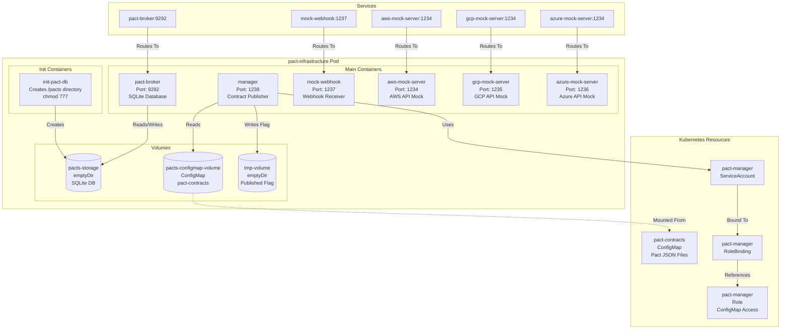

### Port Assignments

| Component | Container Port | Service Port | Purpose |
|-----------|---------------|--------------|---------|
| **pact-broker** | 9292 | 9292 | HTTP API for contract storage |
| **manager** | 1238 | - | Health endpoints (liveness, readiness, ready) |
| **mock-webhook** | 1237 | 1237 | Webhook receiver for testing |
| **aws-mock-server** | 1234 | 1234 | AWS Secrets Manager API mock |
| **gcp-mock-server** | 1235 | 1234 | GCP Secret Manager API mock |
| **azure-mock-server** | 1236 | 1234 | Azure Key Vault API mock |

**Note**: All mock server services use port 1234 externally, but route to different container ports internally.

### Network Topology

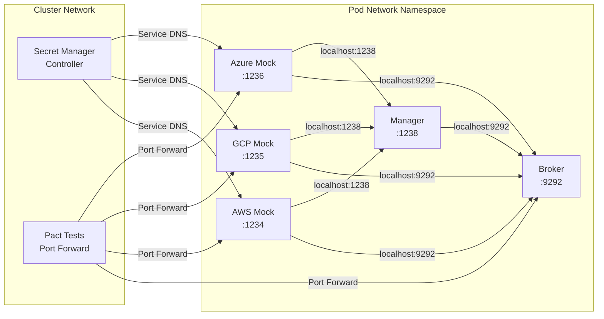

**Key Points**:
- All containers share the pod network namespace
- Components communicate via `localhost` within the pod
- External access via Kubernetes Services
- Port forwarding for local test execution

## Sequence Diagrams

### Startup Sequence

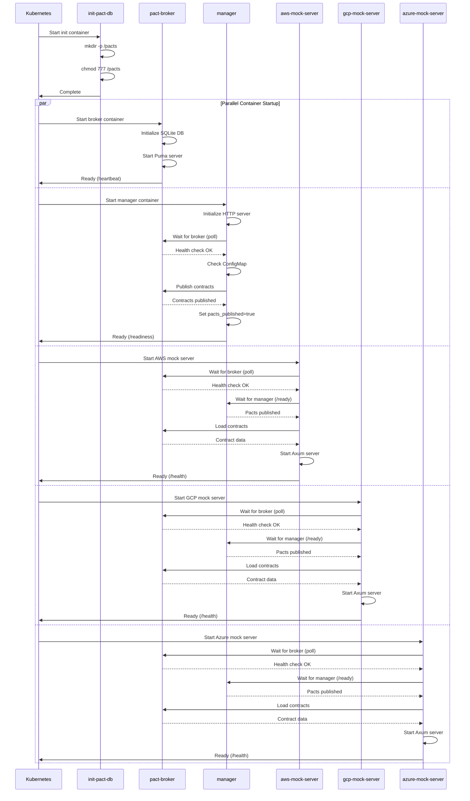

### Contract Publishing Flow

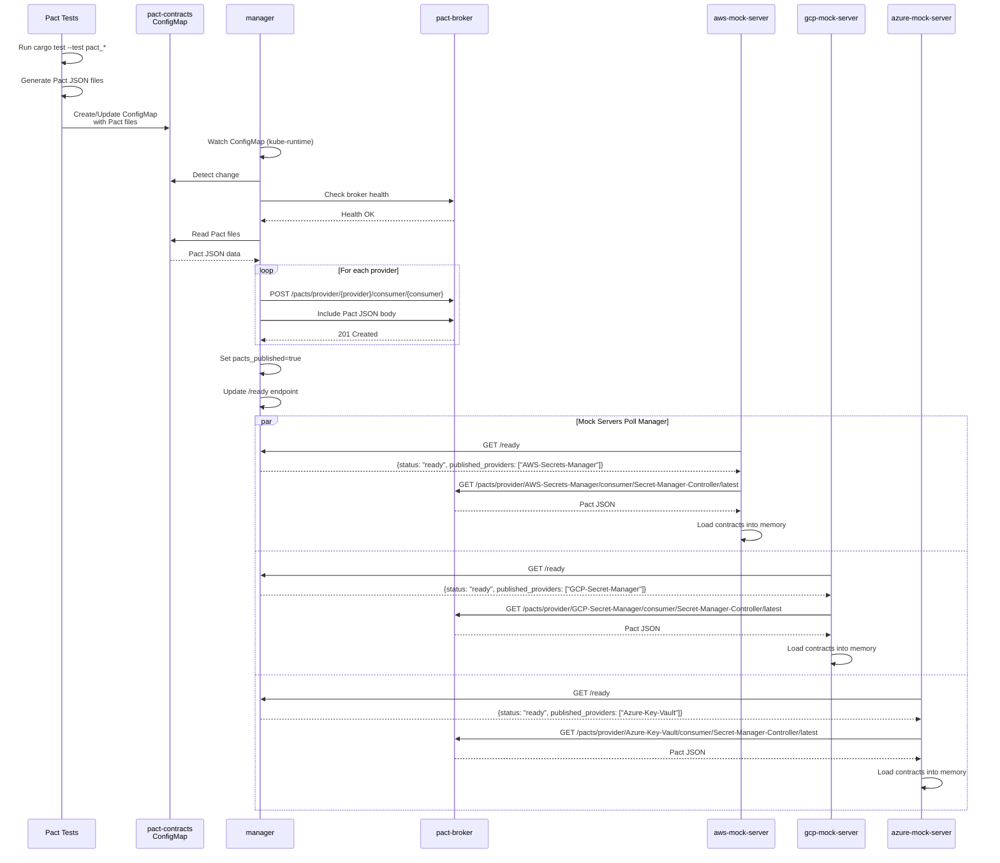

### ConfigMap Watch Flow

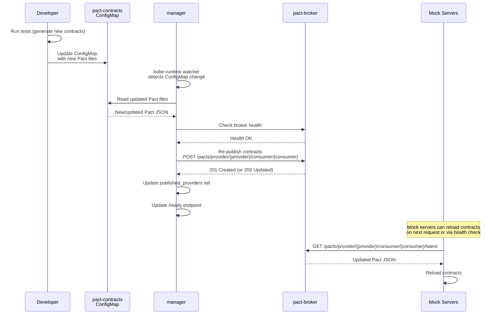

### Test Execution Flow

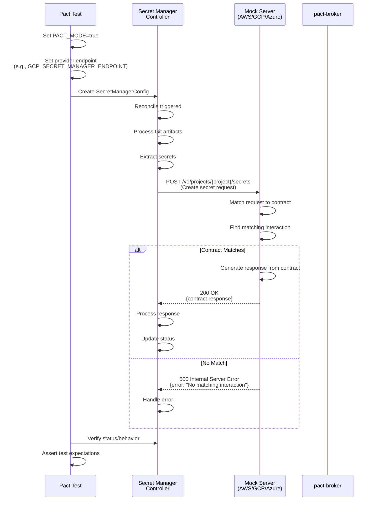

### Manager Sidecar Workflow

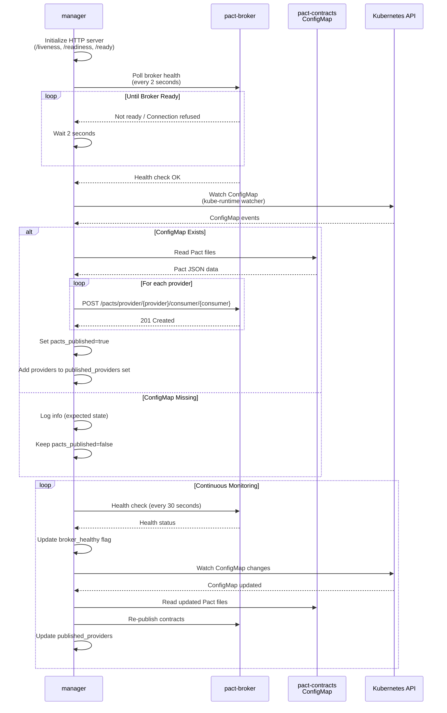

### Mock Server Startup

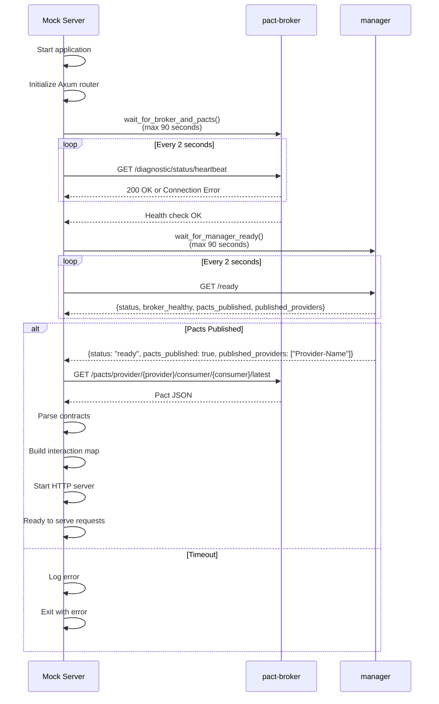

## Call Flow Diagrams

### Controller → Mock Server Interaction (PACT_MODE)

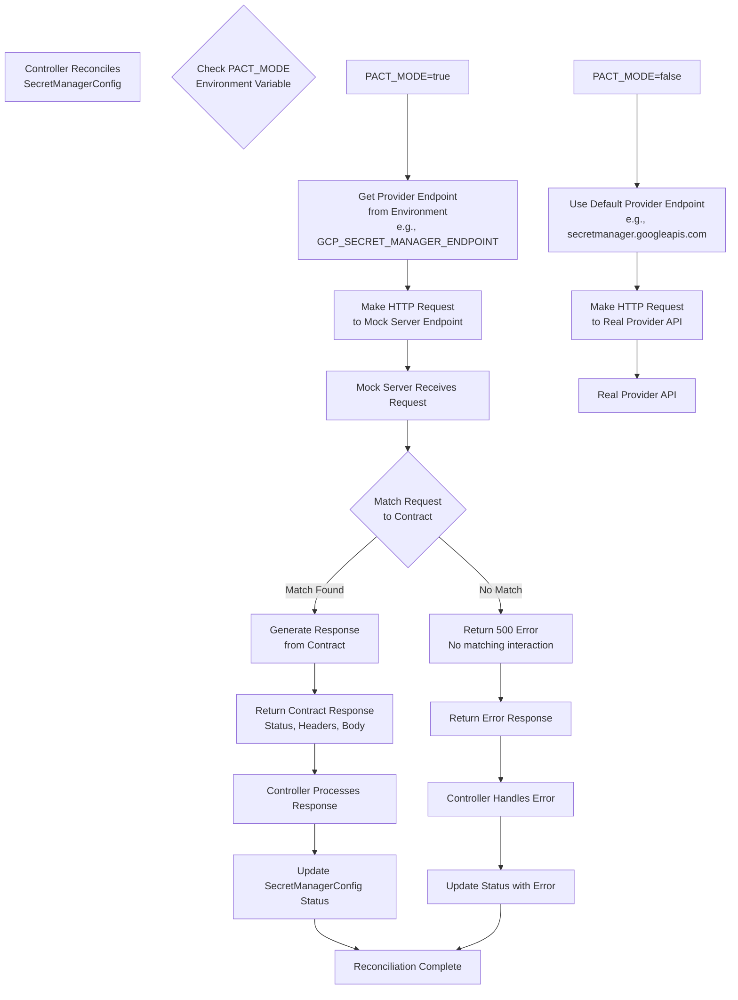

### Manager → Broker Interaction

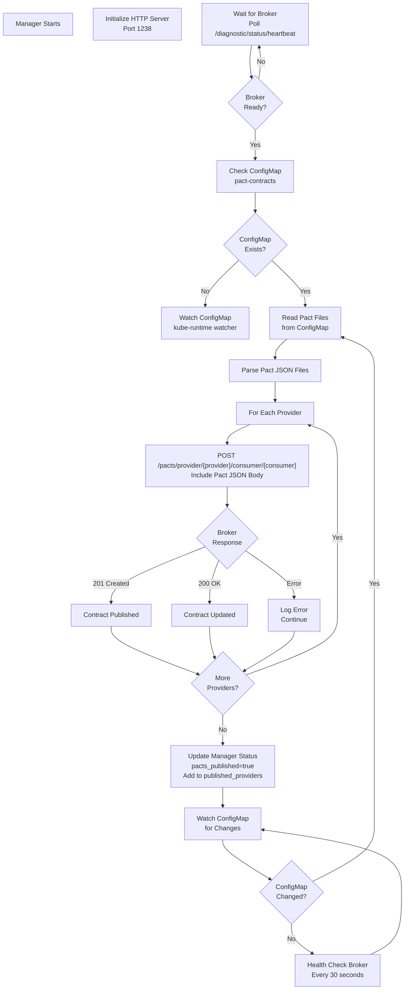

### Manager → ConfigMap Interaction

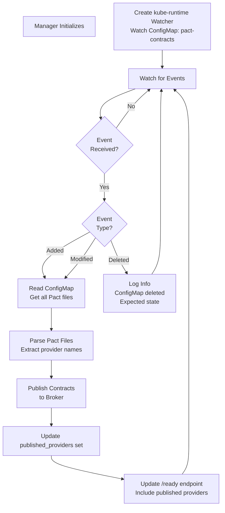

### Mock Server → Broker Interaction

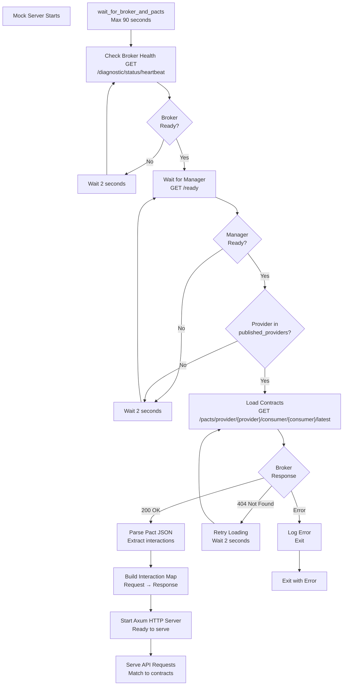

### Test → Controller → Mock Server → Broker Flow

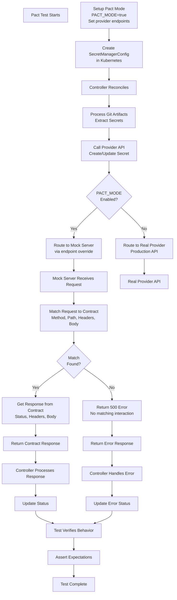

## State Diagrams

### Manager State Machine

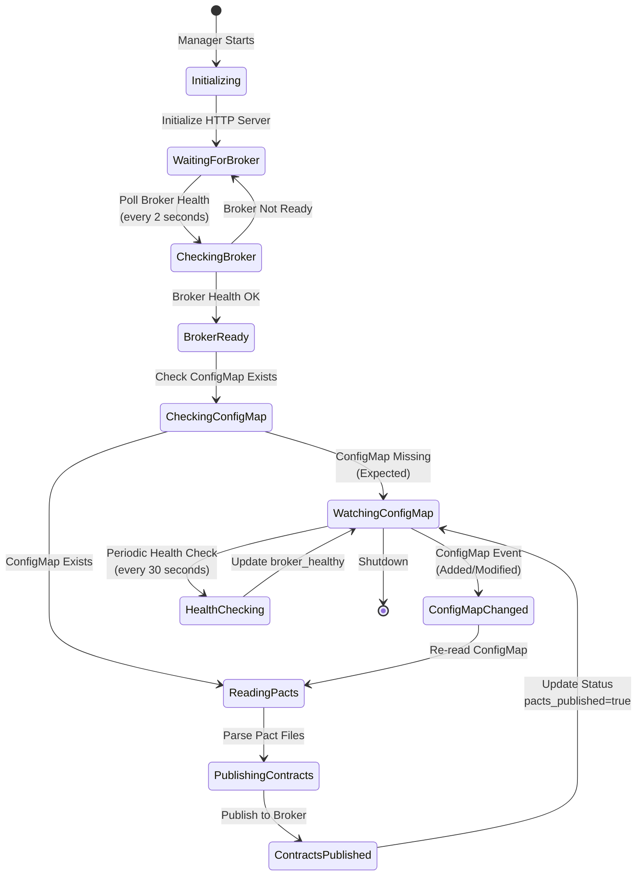

### Mock Server State Machine

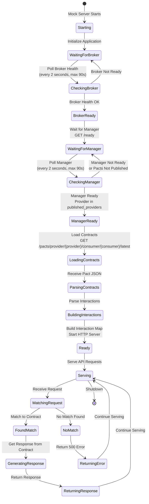

### Contract Publishing State

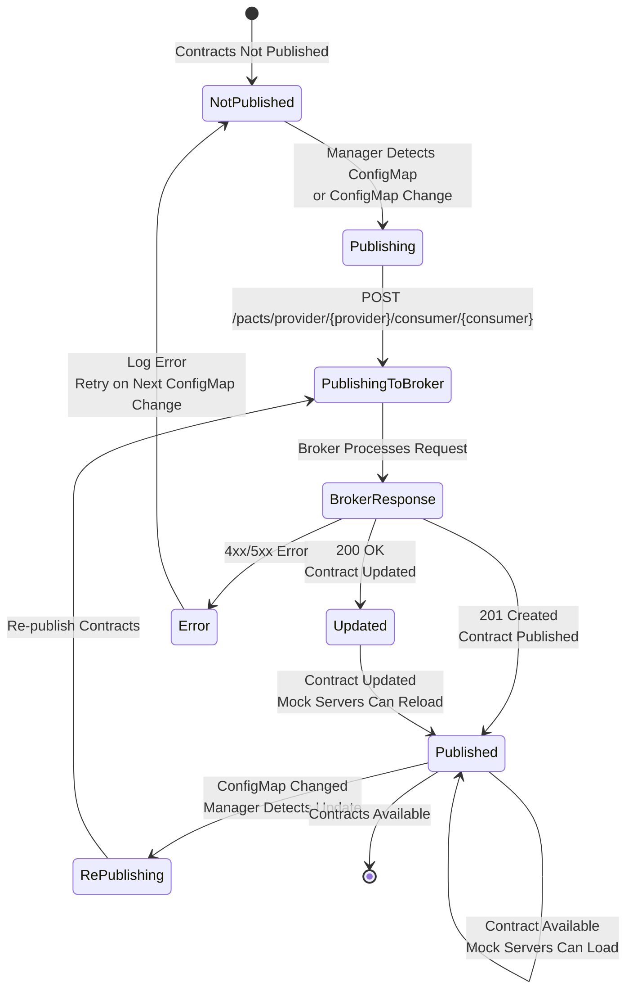

## Architecture Rationale

### Why Combined Deployment?

All Pact infrastructure components are deployed in a single `pact-infrastructure` pod:

**Benefits**:
- **Reduced Startup Time**: Single pod vs multiple deployments (faster CI/CD)
- **Simplified Orchestration**: One resource to manage, single Service
- **Better Resource Utilization**: Shared volumes, shared networking
- **Faster Tilt Startup**: One deployment to wait for
- **Localhost Communication**: Components communicate via `localhost` (no network overhead)

**Trade-offs**:
- **Single Point of Failure**: If pod crashes, all components go down (acceptable for testing)
- **Resource Limits**: All components share pod resource limits (sufficient for testing)

### Why Manager Sidecar?

The manager is a Rust sidecar container that handles contract publishing:

**Benefits over Init Containers**:
- **Dynamic Updates**: Can handle ConfigMap changes without pod restart
- **Health Monitoring**: Provides health endpoints for Kubernetes probes
- **Better Reliability**: More robust than one-time init container execution
- **Observability**: Can monitor and report publishing status

**Responsibilities**:
- Watch Pact broker for readiness
- Publish contracts from ConfigMap to broker
- Watch ConfigMap for changes and re-publish
- Provide health endpoints (`/liveness`, `/readiness`, `/ready`)

### Why ConfigMap Watching?

The manager watches the `pact-contracts` ConfigMap for changes:

**Benefits**:
- **Dynamic Updates**: Contracts can be updated without pod restart
- **Reliability**: Manager ensures contracts are published before mock servers start
- **Observability**: Manager provides health endpoints to track publishing status
- **Flexibility**: Contracts can be updated during development without redeploying

**Implementation**:
- Uses `kube-runtime` watcher for efficient event-driven updates
- Re-publishes contracts when ConfigMap changes
- Tracks published providers in memory

### Port Assignment Rationale

Each component uses a unique port:

| Component | Port | Rationale |
|-----------|------|-----------|
| Broker | 9292 | Standard Pact Broker port |
| Manager | 1238 | Health endpoints, separate from mock servers |
| AWS Mock | 1234 | Standard HTTP port for AWS API |
| GCP Mock | 1235 | Avoid conflict with AWS, sequential numbering |
| Azure Mock | 1236 | Avoid conflict with others, sequential numbering |
| Webhook | 1237 | Separate from mock servers |

**Service Port Mapping**:
- All mock server services expose port 1234 externally
- Route to different container ports internally (1234, 1235, 1236)
- Simplifies controller configuration (all use port 1234)

### Service Account and RBAC Setup

The manager uses a dedicated ServiceAccount with minimal permissions:

**ServiceAccount**: `pact-manager`
- Bound to `pact-infrastructure` pod
- Used by manager sidecar only

**Role Permissions**:
- `list` ConfigMaps (required for watcher)
- `get`, `watch` on `pact-contracts` ConfigMap only
- No write permissions (read-only access)

**Rationale**:
- **Least Privilege**: Only permissions needed for ConfigMap reading
- **Security**: No write access to prevent accidental modifications
- **Isolation**: Manager can't access other resources

## Component Details

### Pact Broker

**Purpose**: Central repository for storing and managing Pact contracts

**Image**: `pactfoundation/pact-broker:latest`

**Configuration**:
- **Database**: SQLite (stored in `/pacts` volume)
- **Port**: 9292
- **Authentication**: Basic auth (username: `pact`, password: `pact`)
- **Public Access**: Heartbeat endpoint public, read access public

**Endpoints**:
- `/diagnostic/status/heartbeat` - Health check (public)
- `/pacts/provider/{provider}/consumer/{consumer}/latest` - Get latest contract
- `/pacts/provider/{provider}/consumer/{consumer}` - Publish contract (POST)

**Storage**:
- SQLite database in `/pacts/pact_broker.sqlite`
- Ephemeral storage (emptyDir) for testing
- Persists contracts in memory during pod lifetime

### Manager Sidecar

**Purpose**: Manages Pact infrastructure lifecycle

**Image**: `pact-mock-server` (Rust binary: `/app/manager`)

**Responsibilities**:
1. **Broker Monitoring**: Polls broker health endpoint
2. **Contract Publishing**: Publishes contracts from ConfigMap to broker
3. **ConfigMap Watching**: Watches for ConfigMap changes
4. **Health Reporting**: Provides health endpoints for Kubernetes probes

**Endpoints**:
- `/liveness` - Liveness probe (broker healthy)
- `/readiness` - Readiness probe (broker healthy AND pacts published)
- `/ready` - Ready check (broker healthy AND pacts published, includes published_providers list)

**State Management**:
- `broker_healthy`: AtomicBool (broker health status)
- `pacts_published`: AtomicBool (contracts published status)
- `published_providers`: RwLock<HashSet<String>> (track published providers)

### Mock Servers

**Purpose**: Serve mock APIs based on contracts loaded from the broker

**Implementation**: Rust/Axum HTTP servers

**Mock Servers**:
- **AWS Mock Server**: Port 1234, replicates AWS Secrets Manager REST API
- **GCP Mock Server**: Port 1235, replicates GCP Secret Manager REST API v1
- **Azure Mock Server**: Port 1236, replicates Azure Key Vault REST API

**Startup Sequence**:
1. Wait for broker to be ready (health check)
2. Wait for manager to confirm pacts are published (`/ready` endpoint)
3. Load contracts from broker
4. Parse contracts and build interaction map
5. Start HTTP server and serve requests

**Contract Matching**:
- Matches requests to contract interactions by:
  - HTTP method
  - Path (exact or pattern)
  - Headers (if specified)
  - Body (if specified)
- Returns contract response on match
- Returns 500 error if no match found

**Features**:
- Request logging middleware
- Rate limiting middleware (via `X-Rate-Limit` header)
- Service unavailable middleware (via `X-Service-Unavailable` header)
- Authentication failure middleware (via `X-Auth-Failure` header)

### Mock Webhook

**Purpose**: Webhook receiver for testing webhook integrations

**Image**: `mock-webhook` (separate image)

**Port**: 1237

**Features**:
- Receives webhook POST requests
- Logs webhook payloads
- Returns success responses
- Used for testing webhook-based integrations

### ConfigMap Structure

**Name**: `pact-contracts`

**Namespace**: `secret-manager-controller-pact-broker`

**Structure**:
```yaml
apiVersion: v1
kind: ConfigMap
metadata:
  name: pact-contracts
  namespace: secret-manager-controller-pact-broker
data:
  secret-manager-controller-gcp-secret-manager.json: |
    {
      "consumer": {"name": "Secret-Manager-Controller"},
      "provider": {"name": "GCP-Secret-Manager"},
      "interactions": [...]
    }
  secret-manager-controller-aws-secrets-manager.json: |
    {
      "consumer": {"name": "Secret-Manager-Controller"},
      "provider": {"name": "AWS-Secrets-Manager"},
      "interactions": [...]
    }
  # ... other provider contracts
```

**Volume Mount**:
- Mounted at `/pacts-configmap` in manager container
- Read-only access
- Optional (may not exist if contracts haven't been generated)

## Network Communication

### Within Pod (localhost)

All containers share the pod network namespace:

- **Broker**: `http://localhost:9292`
- **Manager**: `http://localhost:1238`
- **Mock Servers**: `http://localhost:1234/1235/1236`

**Benefits**:
- No network overhead
- No DNS resolution needed
- Fast communication
- Simplified configuration

### External Access (Services)

Kubernetes Services provide external access:

- **Broker Service**: `pact-broker:9292`
- **Mock Server Services**: `aws-mock-server:1234`, `gcp-mock-server:1234`, `azure-mock-server:1234`
- **Webhook Service**: `mock-webhook:1237`

**Controller Access**:
```yaml
env:
  - name: GCP_SECRET_MANAGER_ENDPOINT
    value: "http://gcp-mock-server.secret-manager-controller-pact-broker.svc.cluster.local:1234"
```

### Port Forwarding (Local Testing)

For local test execution:

```bash
kubectl port-forward -n secret-manager-controller-pact-broker svc/pact-broker 9292:9292
kubectl port-forward -n secret-manager-controller-pact-broker svc/gcp-mock-server 1235:1234
```

Tests connect to `localhost:9292` and `localhost:1235`.

## Health Checks and Probes

### Broker Probes

**Startup Probe**:
- Path: `/diagnostic/status/heartbeat`
- Initial Delay: 30s
- Period: 15s
- Timeout: 5s
- Failure Threshold: 5

**Readiness Probe**:
- Path: `/diagnostic/status/heartbeat`
- Initial Delay: 15s
- Period: 30s
- Timeout: 3s
- Failure Threshold: 3

**Liveness Probe**:
- Path: `/diagnostic/status/heartbeat`
- Initial Delay: 30s
- Period: 30s
- Timeout: 3s
- Failure Threshold: 3

### Manager Probes

**Liveness Probe**:
- Path: `/liveness`
- Port: 1238
- Returns 200 if broker is healthy

**Readiness Probe**:
- Path: `/readiness`
- Port: 1238
- Returns 200 if broker is healthy AND pacts are published

**Ready Endpoint**:
- Path: `/ready`
- Port: 1238
- Returns JSON with status, broker_healthy, pacts_published, published_providers

### Mock Server Probes

**Startup Probe**:
- Path: `/health`
- Initial Delay: 60s (allows time for broker and manager)
- Period: 10s
- Timeout: 3s
- Failure Threshold: 15 (allows up to 3.5 minutes total)

**Readiness Probe**:
- Path: `/health`
- Initial Delay: 2s
- Period: 30s
- Timeout: 3s
- Failure Threshold: 3

**Liveness Probe**:
- Path: `/health`
- Initial Delay: 10s
- Period: 30s
- Timeout: 3s
- Failure Threshold: 3

## Resource Requirements

### Broker

```yaml
resources:
  requests:
    memory: 128Mi
    cpu: 50m
  limits:
    memory: 256Mi
    cpu: 200m
```

### Manager

```yaml
resources:
  requests:
    memory: 64Mi
    cpu: 50m
  limits:
    memory: 128Mi
    cpu: 100m
```

### Mock Servers

```yaml
resources:
  requests:
    memory: 64Mi
    cpu: 50m
  limits:
    memory: 128Mi
    cpu: 100m
```

**Total Pod Resources**:
- **Requests**: ~512Mi memory, 350m CPU
- **Limits**: ~896Mi memory, 700m CPU

## Troubleshooting

### Broker Not Starting

**Symptoms**: Broker container keeps restarting

**Diagnosis**:
```bash
kubectl logs -n secret-manager-controller-pact-broker -l app=pact-infrastructure -c pact-broker
```

**Common Issues**:
- Database directory not created (check init container)
- Port conflict (unlikely in pod)
- Resource constraints

### Manager Not Publishing

**Symptoms**: Mock servers wait indefinitely for contracts

**Diagnosis**:
```bash
kubectl logs -n secret-manager-controller-pact-broker -l app=pact-infrastructure -c manager
```

**Common Issues**:
- ConfigMap doesn't exist (expected if contracts not generated)
- Broker not ready (check broker logs)
- RBAC permissions (check ServiceAccount, Role, RoleBinding)

### Mock Servers Not Starting

**Symptoms**: Mock server containers fail startup probe

**Diagnosis**:
```bash
kubectl logs -n secret-manager-controller-pact-broker -l app=pact-infrastructure -c gcp-mock-server
```

**Common Issues**:
- Broker not ready (check broker health)
- Manager not ready (check manager `/ready` endpoint)
- Contracts not published (check manager logs)
- Timeout waiting (increase timeout or check broker/manager)

### Contracts Not Loading

**Symptoms**: Mock servers start but return "No matching interaction"

**Diagnosis**:
```bash
# Check if contracts are published
curl http://localhost:9292/pacts/provider/GCP-Secret-Manager/consumer/Secret-Manager-Controller/latest

# Check manager status
curl http://localhost:1238/ready
```

**Common Issues**:
- Contracts not published (check manager logs)
- Wrong provider/consumer names (check contract files)
- Contracts expired or deleted (re-publish)

## Next Steps

- [Pact Testing Overview](./overview.md) - Pact concepts and workflow
- [Pact Testing Setup](./setup.md) - Setting up Pact infrastructure
- [Writing Pact Tests](./writing-tests.md) - How to write contract tests

