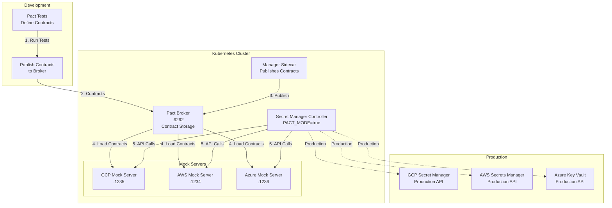

# Pact Testing Overview

Comprehensive overview of Pact contract testing in the Secret Manager Controller, including concepts, workflow, and benefits.

## What is Pact?

Pact is a consumer-driven contract testing framework that enables testing of interactions between services without requiring both services to be running simultaneously.

### Key Concepts

**Consumer**: The service that makes requests (Secret Manager Controller)  
**Provider**: The service that responds to requests (GCP Secret Manager, AWS Secrets Manager, Azure Key Vault)  
**Contract**: A specification of the expected interaction between consumer and provider  
**Mock Server**: A test double that responds based on contract definitions

### Consumer-Driven Contracts

In Pact, the **consumer** (controller) defines the contract:
- What requests it will make
- What responses it expects
- This ensures the provider API matches what the consumer needs

## Why Pact for Secret Manager Controller?

### Benefits

1. **No Cloud Credentials Required**: Test provider interactions without real cloud credentials
2. **Fast Tests**: Mock servers respond instantly without network latency
3. **Offline Development**: Develop and test without internet connectivity
4. **Contract Verification**: Ensure API compatibility between controller and providers
5. **CI/CD Efficiency**: Run tests faster without waiting for real API calls
6. **Isolation**: Test in Kind cluster without external dependencies

### Use Cases

- **Local Development**: Test controller behavior without cloud provider setup
- **Integration Testing**: Verify controller works with provider APIs
- **Contract Evolution**: Catch breaking API changes early
- **CI/CD Pipelines**: Automated contract verification

## Architecture Overview



## Components

### 1. Pact Broker

**Purpose**: Central repository for storing and managing Pact contracts

**Features**:
- Stores contracts from tests
- Serves contracts to mock servers
- Tracks contract versions
- Provides web UI for contract browsing

**Location**: `pact-infrastructure` deployment, port 9292

**Access**:
```bash
# Port forward to broker
kubectl port-forward -n secret-manager-controller-pact-broker svc/pact-broker 9292:9292

# Access web UI
open http://localhost:9292
```

### 2. Mock Servers

**Purpose**: Serve mock APIs based on contracts loaded from the broker

**Implementation**: Rust/Axum HTTP servers

**Mock Servers**:
- **GCP Mock Server**: Port 1235, replicates GCP Secret Manager REST API v1
- **AWS Mock Server**: Port 1234, replicates AWS Secrets Manager REST API
- **Azure Mock Server**: Port 1236, replicates Azure Key Vault REST API

**Features**:
- Load contracts from Pact broker on startup
- Serve mock API endpoints matching cloud provider APIs
- Respond to controller requests based on contract expectations
- Wait for contracts to be published before starting

### 3. Manager Sidecar

**Purpose**: Publishes contracts to the broker and watches for changes

**Features**:
- Watches Pact broker for readiness
- Publishes contracts from ConfigMap to broker
- Watches ConfigMap for changes and re-publishes
- Provides health endpoints (`/liveness`, `/readiness`, `/ready`)

**Location**: `pact-infrastructure` deployment, port 8080

### 4. Secret Manager Controller

**Purpose**: Kubernetes controller that reconciles SecretManagerConfig CRDs

**Pact Mode**: When `PACT_MODE=true`, routes requests to mock servers instead of real cloud APIs

**Configuration**:
```yaml
env:
  - name: PACT_MODE
    value: "true"
  - name: GCP_SECRET_MANAGER_ENDPOINT
    value: "http://gcp-mock-server:1235"
  - name: AWS_SECRETS_MANAGER_ENDPOINT
    value: "http://aws-mock-server:1234"
  - name: AZURE_KEY_VAULT_ENDPOINT
    value: "http://azure-mock-server:1236"
```

## Workflow

### 1. Contract Definition

Pact tests define contracts by specifying:
- **Request**: Method, path, headers, body
- **Response**: Status code, headers, body
- **Provider State**: Preconditions (e.g., "secret exists")

Example:
```rust
pact_builder.interaction("create a new secret", "", |mut i| {
    i.given("a GCP project exists");
    i.request
        .method("POST")
        .path("/v1/projects/test-project/secrets")
        .json_body(json!({
            "secretId": "test-secret-name"
        }));
    i.response
        .status(200)
        .json_body(json!({
            "name": "projects/test-project/secrets/test-secret-name"
        }));
    i
});
```

### 2. Contract Publishing

Contracts are published to the Pact broker:

1. **Test Execution**: Run Pact tests (`cargo test --test pact_*`)
2. **Contract Generation**: Tests generate Pact JSON files in `target/pacts/`
3. **ConfigMap Creation**: Contracts are added to `pact-contracts` ConfigMap
4. **Manager Publishing**: Manager sidecar publishes contracts to broker

### 3. Mock Server Startup

Mock servers start in this order:

1. **Wait for Broker**: Mock servers wait for broker to be ready
2. **Wait for Contracts**: Mock servers wait for manager to confirm contracts are published
3. **Load Contracts**: Mock servers load contracts from broker
4. **Start Serving**: Mock servers start serving API endpoints

### 4. Controller Testing

When `PACT_MODE=true`:

1. **Controller Requests**: Controller makes API calls to mock servers
2. **Contract Matching**: Mock servers match requests to contract expectations
3. **Mock Responses**: Mock servers respond based on contract definitions
4. **Verification**: Tests verify controller handles responses correctly

## Test Coverage

### GCP Secret Manager

**12 Contract Tests**:
- Create secret
- Get secret
- List secrets
- Add secret version
- Get secret version
- Delete secret
- Update secret labels
- Error handling (not found, permission denied, etc.)

### AWS Secrets Manager

**13 Contract Tests**:
- Create secret
- Get secret value
- List secrets
- Update secret
- Delete secret
- Tag operations
- Error handling

### AWS Parameter Store

**6 Contract Tests**:
- Put parameter
- Get parameter
- Get parameters by path
- Delete parameter
- Error handling

### Azure Key Vault

**14 Contract Tests**:
- Set secret
- Get secret
- List secrets
- Delete secret
- Update secret properties
- Error handling

### Azure App Configuration

**6 Contract Tests**:
- Set configuration
- Get configuration
- List configurations
- Delete configuration
- Error handling

**Total**: 51+ Pact contract tests

## Running Pact Tests

### Prerequisites

1. **Pact Infrastructure Running**:
   ```bash
   # Via Tilt (recommended)
   tilt up
   
   # Or manually deploy
   kubectl apply -f pact-broker/k8s/
   ```

2. **Wait for Infrastructure**:
   ```bash
   kubectl wait --for=condition=ready pod -l app=pact-infrastructure \
     -n secret-manager-controller-pact-broker --timeout=5m
   ```

### Running Tests

**Using Script** (Recommended):
```bash
python3 scripts/pact_tests.py
```

The script:
- Waits for Pact infrastructure to be ready
- Sets up port forwarding to mock servers
- Waits for contracts to be published
- Runs all Pact test files sequentially
- Cleans up port forwarding

**Manual Execution**:
```bash
# Run all Pact tests
cargo test --test pact_*

# Run specific provider tests
cargo test --test pact_gcp_secret_manager
cargo test --test pact_aws_secrets_manager
cargo test --test pact_azure_key_vault

# Run with verbose output
cargo test --test pact_* -- --nocapture
```

## Contract Files

### Location

Contracts are generated in `target/pacts/` when tests run:

```
target/pacts/
├── secret-manager-controller-gcp-secret-manager.json
├── secret-manager-controller-aws-secrets-manager.json
├── secret-manager-controller-aws-parameter-store.json
├── secret-manager-controller-azure-key-vault.json
└── secret-manager-controller-azure-app-configuration.json
```

### Contract Structure

Each contract file contains:
- **Consumer**: Secret-Manager-Controller
- **Provider**: Provider name (e.g., GCP-Secret-Manager)
- **Interactions**: Array of request/response pairs
- **Metadata**: Version, timestamp, etc.

### Publishing to Broker

Contracts are published via:
1. **ConfigMap**: Contracts stored in `pact-contracts` ConfigMap
2. **Manager Sidecar**: Reads ConfigMap and publishes to broker
3. **Broker Storage**: Contracts stored in broker database

## Pact Mode Configuration

### Enabling Pact Mode

Set environment variables in controller deployment:

```yaml
env:
  - name: PACT_MODE
    value: "true"
  - name: GCP_SECRET_MANAGER_ENDPOINT
    value: "http://gcp-mock-server.secret-manager-controller-pact-broker.svc.cluster.local:1235"
  - name: AWS_SECRETS_MANAGER_ENDPOINT
    value: "http://aws-mock-server.secret-manager-controller-pact-broker.svc.cluster.local:1234"
  - name: AZURE_KEY_VAULT_ENDPOINT
    value: "http://azure-mock-server.secret-manager-controller-pact-broker.svc.cluster.local:1236"
```

### Disabling Pact Mode

Remove or set `PACT_MODE=false` to use real cloud provider APIs:

```yaml
env:
  - name: PACT_MODE
    value: "false"
  # Remove endpoint overrides to use default provider endpoints
```

## Benefits of Pact Testing

### Development Speed

- **Fast Iteration**: Mock servers respond instantly
- **No Setup Required**: No need for cloud credentials or accounts
- **Offline Development**: Work without internet connectivity

### Reliability

- **Contract Verification**: Ensures API compatibility
- **Regression Prevention**: Catches breaking API changes
- **Test Isolation**: Tests don't depend on external services

### CI/CD Efficiency

- **Fast Tests**: No network latency or rate limits
- **Deterministic**: Tests produce consistent results
- **Parallel Execution**: Can run multiple test suites in parallel

## Limitations

### What Pact Tests Don't Cover

- **Real Provider Behavior**: Tests use mocks, not real providers
- **Network Issues**: Doesn't test network failures or timeouts
- **Authentication**: Mock servers use dummy tokens
- **Rate Limiting**: Doesn't test provider rate limits

### When to Use Real Providers

Use real provider APIs for:
- **End-to-End Testing**: Full integration with real providers
- **Performance Testing**: Measure actual API latency
- **Production Validation**: Verify against production APIs

## Next Steps

- [Pact Testing Setup](./setup.md) - Setting up Pact infrastructure
- [Writing Pact Tests](./writing-tests.md) - How to write Pact contract tests
- [Pact Testing Architecture](./architecture.md) - Detailed architecture and diagrams

