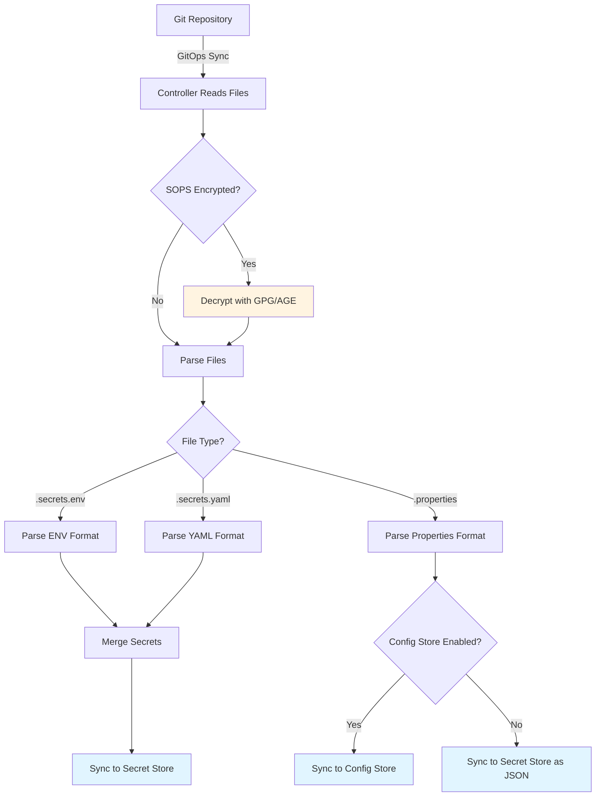

# Application Files Guide

Complete guide to the application file formats supported by the Secret Manager Controller.

## Supported File Types

The controller processes three types of application files:

1. **`application.secrets.env`** - Environment variable format for secrets
2. **`application.secrets.yaml`** - YAML format for secrets
3. **`application.properties`** - Java properties format for configuration

## File Discovery

The controller automatically discovers these files in your Git repository based on the `kustomizePath` or `basePath` configuration:

### With Kustomize Path

When `kustomizePath` is specified, the controller:
1. Runs `kustomize build` on the specified path
2. Extracts Kubernetes Secret resources from the generated YAML
3. Uses the `data` or `stringData` fields as secrets

### Without Kustomize Path (Raw File Mode)

When `kustomizePath` is not specified, the controller searches for files in this order:

```
{basePath}/{service}/deployment-configuration/profiles/{environment}/
  ├── application.secrets.env
  ├── application.secrets.yaml
  └── application.properties
```

Or for single-service repositories:

```
deployment-configuration/profiles/{environment}/
  ├── application.secrets.env
  ├── application.secrets.yaml
  └── application.properties
```

## application.secrets.env

Environment variable format for secrets. This is the simplest format for key-value pairs.

### Format

```bash
# Enabled secrets
DATABASE_PASSWORD=super-secret-password
API_KEY=sk_live_1234567890
JWT_SECRET=my-jwt-secret-key

# Disabled secrets (commented out)
#OLD_API_KEY=deprecated-key
#LEGACY_PASSWORD=old-password
```

### Features

- **Simple key-value pairs**: `KEY=value` format
- **Comment support**: Lines starting with `#` are treated as disabled secrets
- **SOPS encryption**: Can be encrypted with SOPS (GPG or AGE keys)
- **Merging**: If both `.env` and `.yaml` files exist, `.yaml` values override `.env` values

### Disabled Secrets

Commented lines (starting with `#`) are parsed but marked as disabled:
- **Enabled secrets**: Synced to cloud provider secret manager
- **Disabled secrets**: Disabled in cloud provider (but not deleted) - useful for secret rotation

**Example:**
```bash
# Active secret
DATABASE_PASSWORD=new-password

# Disabled (old secret being rotated out)
#DATABASE_PASSWORD=old-password
```

The controller will:
1. Create/update `DATABASE_PASSWORD` with value `new-password`
2. Disable (but not delete) any existing `DATABASE_PASSWORD` with value `old-password`

### SOPS Encryption

Encrypt with SOPS:

```bash
# Encrypt the file
sops -e -i application.secrets.env

# Verify encryption
sops -d application.secrets.env
```

The encrypted file will have SOPS metadata embedded:

```yaml
DATABASE_PASSWORD: ENC[AES256_GCM,data:...,iv:...,tag:...,type:str]
sops:
  kms: []
  gcp_kms: []
  azure_kv: []
  hc_vault: []
  age:
    - recipient: age1...
      enc: |
        ...
  lastmodified: "2024-01-15T10:30:00Z"
  mac: ENC[AES256_GCM,data:...,iv:...,tag:...,type:str]
  pgp: []
  encrypted_regex: ^(data|stringData|DATABASE_PASSWORD|API_KEY)
  version: 3.8.1
```

## application.secrets.yaml

YAML format for secrets. Supports nested structures that are automatically flattened.

### Format

```yaml
# Enabled secrets
database:
  password: super-secret-password
  username: admin

api:
  key: sk_live_1234567890
  secret: api-secret-key

jwt:
  secret: my-jwt-secret-key

# Disabled secrets (commented out)
#old_api:
#  key: deprecated-key
#legacy:
#  password: old-password
```

### Features

- **Nested structures**: Supports hierarchical YAML
- **Automatic flattening**: Nested keys are flattened with dot notation
- **Comment support**: Commented sections (starting with `#`) are treated as disabled secrets
- **SOPS encryption**: Can be encrypted with SOPS (GPG or AGE keys)
- **Merging**: If both `.env` and `.yaml` files exist, `.yaml` values override `.env` values

### Flattening

Nested YAML structures are automatically flattened:

**Input:**
```yaml
database:
  connection:
    password: secret123
    host: db.example.com
```

**Flattened to:**
```
database.connection.password = secret123
database.connection.host = db.example.com
```

### Disabled Secrets

Commented sections (starting with `#`) are parsed but marked as disabled:
- **Enabled secrets**: Synced to cloud provider secret manager
- **Disabled secrets**: Disabled in cloud provider (but not deleted) - useful for secret rotation

**Example:**
```yaml
# Active secret
database:
  password: new-password

# Disabled (old secret being rotated out)
#database:
#  password: old-password
```

The controller will:
1. Create/update `database.password` with value `new-password`
2. Disable (but not delete) any existing `database.password` with value `old-password`

**Note:** You can comment out entire sections or individual keys. The controller will flatten the structure and handle disabled secrets appropriately.

### SOPS Encryption

Encrypt with SOPS:

```bash
# Encrypt the file
sops -e -i application.secrets.yaml

# Verify encryption
sops -d application.secrets.yaml
```

The encrypted file will have SOPS metadata and encrypted values:

```yaml
database:
  password: ENC[AES256_GCM,data:...,iv:...,tag:...,type:str]
  username: ENC[AES256_GCM,data:...,iv:...,tag:...,type:str]
sops:
  # ... SOPS metadata ...
```

## application.properties

Java properties format for configuration values. These are routed to config stores (when enabled) instead of secret stores.

### Format

```properties
# Database configuration
database.host=db.example.com
database.port=5432
database.name=myapp

# API configuration
api.timeout=30s
api.retries=3

# Feature flags
feature.new-ui.enabled=true
feature.analytics.enabled=false
```

### Features

- **Key-value pairs**: `key=value` format
- **Comment support**: Lines starting with `#` are ignored
- **Config store routing**: When `configs.enabled=true`, properties are stored in config stores (not secret stores)
- **Individual storage**: Each property is stored as a separate parameter in config stores

### Routing Behavior

#### When `configs.enabled=false` (Default)

Properties are stored as a JSON blob in the secret store:

```json
{
  "database.host": "db.example.com",
  "database.port": "5432",
  "api.timeout": "30s"
}
```

Stored as secret: `{prefix}-properties-{suffix}`

#### When `configs.enabled=true`

Properties are stored individually in config stores:

- **AWS**: Parameter Store at `/my-service/dev/database.host`, `/my-service/dev/database.port`, etc.
- **GCP**: Secret Manager (interim) or Parameter Manager (future) as individual secrets
- **Azure**: App Configuration as individual configuration keys

### SOPS Encryption

Properties files can also be encrypted with SOPS:

```bash
# Encrypt the file
sops -e -i application.properties

# Verify encryption
sops -d application.properties
```

## File Processing Order

When multiple files are present, they are processed in this order:

1. **`application.secrets.env`** - Parsed first
2. **`application.secrets.yaml`** - Parsed second (overrides `.env` values)
3. **`application.properties`** - Parsed separately (routed to config stores)

**Merging behavior:**
- If a key exists in both `.env` and `.yaml`, the `.yaml` value takes precedence
- Properties are always processed separately (never merged with secrets)

## SOPS Encryption

All three file types support SOPS encryption with both GPG and AGE keys.

### GPG Encryption

See [SOPS Setup Guide](./sops-setup.md) for GPG key setup.

### AGE Encryption

AGE (Actually Good Encryption) is a modern alternative to GPG.

#### Generate AGE Key

```bash
# Generate a new AGE key pair
age-keygen -o age-key.txt
```

This creates:
- **Public key**: `age1...` (share this)
- **Private key**: `AGE-SECRET-KEY-1...` (keep this secret)

#### Configure SOPS for AGE

Create or update `.sops.yaml`:

```yaml
creation_rules:
  - path_regex: .*\.secrets\.(env|yaml)$
    encrypted_regex: ^(data|stringData|DATABASE_|API_|JWT_)
    age: >-
      age1abc123def456...
      age1xyz789uvw012...
```

#### Encrypt Files

```bash
# Encrypt with AGE
sops -e -i application.secrets.env

# Verify
sops -d application.secrets.env
```

#### Store AGE Key in Kubernetes

```bash
# Export private key
cat age-key.txt | grep "AGE-SECRET-KEY" > /tmp/age-private-key.txt

# Create Kubernetes Secret
kubectl create secret generic sops-age-key \
  --from-file=private.key=/tmp/age-private-key.txt \
  -n octopilot-system

# Clean up
rm /tmp/age-private-key.txt
```

#### Configure SecretManagerConfig

```yaml
spec:
  secrets:
    sops:
      enabled: true
      ageSecretRef:
        name: sops-age-key
        namespace: octopilot-system
        key: private.key
```

**Note:** The controller supports both GPG and AGE keys. You can use either or both.

## Controller Processing Flow



## Examples

### Complete Example

**Repository structure:**
```
my-service/
└── deployment-configuration/
    └── profiles/
        └── dev/
            ├── application.secrets.env
            ├── application.secrets.yaml
            └── application.properties
```

**application.secrets.env:**
```bash
DATABASE_PASSWORD=secret123
API_KEY=key-abc-123
```

**application.secrets.yaml:**
```yaml
database:
  username: admin
  password: yaml-override-password  # Overrides DATABASE_PASSWORD from .env
jwt:
  secret: jwt-secret-key
```

**application.properties:**
```properties
database.host=db.example.com
database.port=5432
api.timeout=30s
```

**Result:**
- **Secrets synced:**
  - `DATABASE_PASSWORD` = `yaml-override-password` (from `.yaml`, overrides `.env`)
  - `API_KEY` = `key-abc-123` (from `.env`)
  - `database.username` = `admin` (from `.yaml`, flattened)
  - `jwt.secret` = `jwt-secret-key` (from `.yaml`, flattened)

- **Properties synced** (if `configs.enabled=true`):
  - `/my-service/dev/database.host` = `db.example.com`
  - `/my-service/dev/database.port` = `5432`
  - `/my-service/dev/api.timeout` = `30s`

### With SOPS Encryption

**Encrypted application.secrets.env:**
```bash
DATABASE_PASSWORD: ENC[AES256_GCM,data:...,iv:...,tag:...,type:str]
API_KEY: ENC[AES256_GCM,data:...,iv:...,tag:...,type:str]
sops:
  age:
    - recipient: age1abc123...
      enc: |
        ...
  lastmodified: "2024-01-15T10:30:00Z"
  mac: ENC[AES256_GCM,data:...,iv:...,tag:...,type:str]
  encrypted_regex: ^(DATABASE_|API_)
  version: 3.8.1
```

The controller will:
1. Detect SOPS encryption
2. Load AGE or GPG key from Kubernetes Secret
3. Decrypt the file
4. Parse the decrypted content
5. Sync secrets to cloud provider

## Best Practices

1. **Use SOPS encryption**: Always encrypt secrets in Git
2. **Separate secrets from configs**: Use `.secrets.*` for secrets, `.properties` for configs
3. **Use YAML for complex structures**: `.yaml` format for nested configurations
4. **Use ENV for simplicity**: `.env` format for flat key-value pairs
5. **Enable config stores**: Set `configs.enabled=true` to route properties to config stores
6. **Comment out disabled secrets**: Use `#` prefix to disable secrets without deleting them
7. **Version control**: All files should be in Git with proper encryption

## Troubleshooting

### Files Not Found

**Error:** `No application files found`

**Solutions:**
1. Check the `kustomizePath` or `basePath` is correct
2. Verify files exist in the Git repository
3. Check the `environment` matches the directory name

### Parsing Errors

**Error:** `Failed to parse YAML` or `Invalid ENV format`

**Solutions:**
1. Validate YAML syntax: `yamllint application.secrets.yaml`
2. Check ENV format: Each line should be `KEY=value`
3. Verify properties format: Each line should be `key=value`

### SOPS Decryption Fails

See [SOPS Setup Guide](./sops-setup.md) for troubleshooting SOPS issues.

## Next Steps

- [SOPS Setup](./sops-setup.md) - Set up SOPS encryption
- [Configuration Reference](../getting-started/configuration.md) - Complete configuration guide
- [Config Store Setup](../getting-started/configuration.md#config-store-configuration) - Enable config stores

