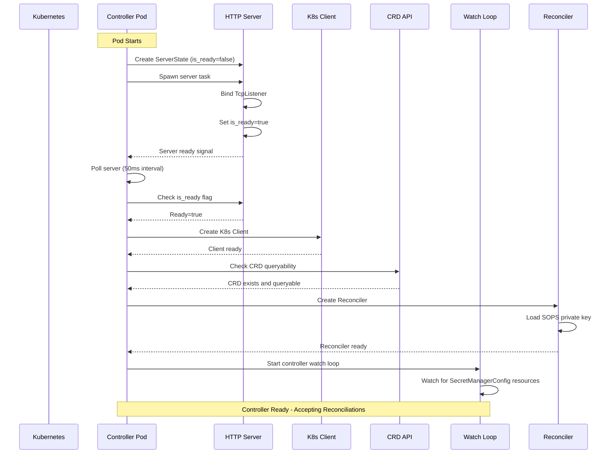
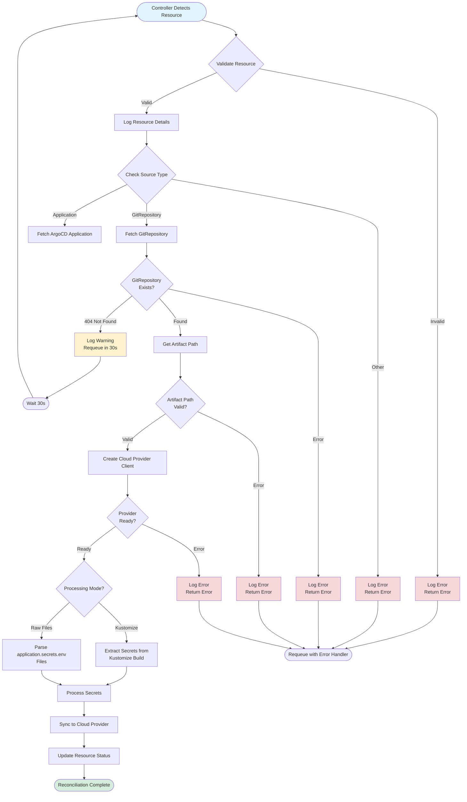
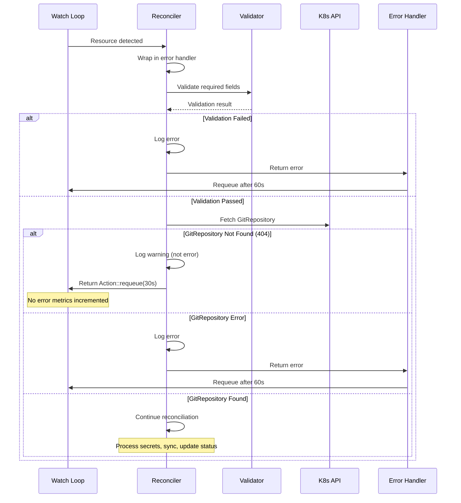
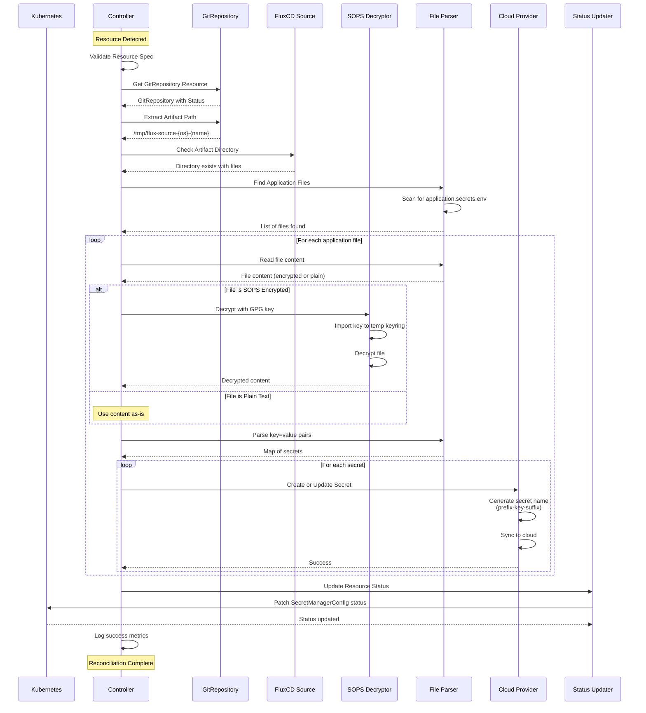
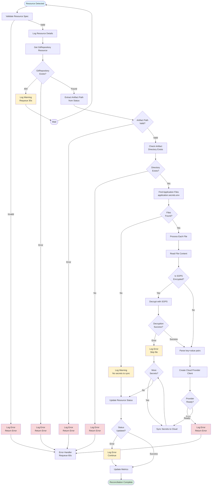
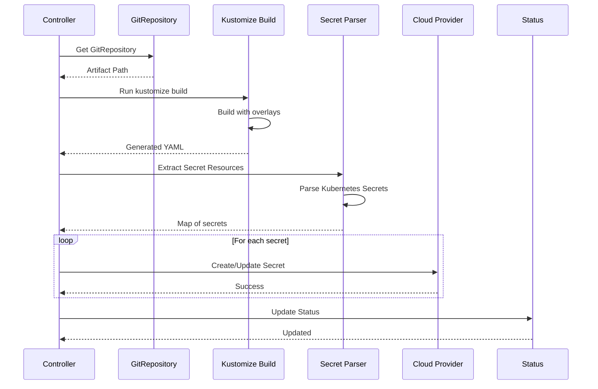
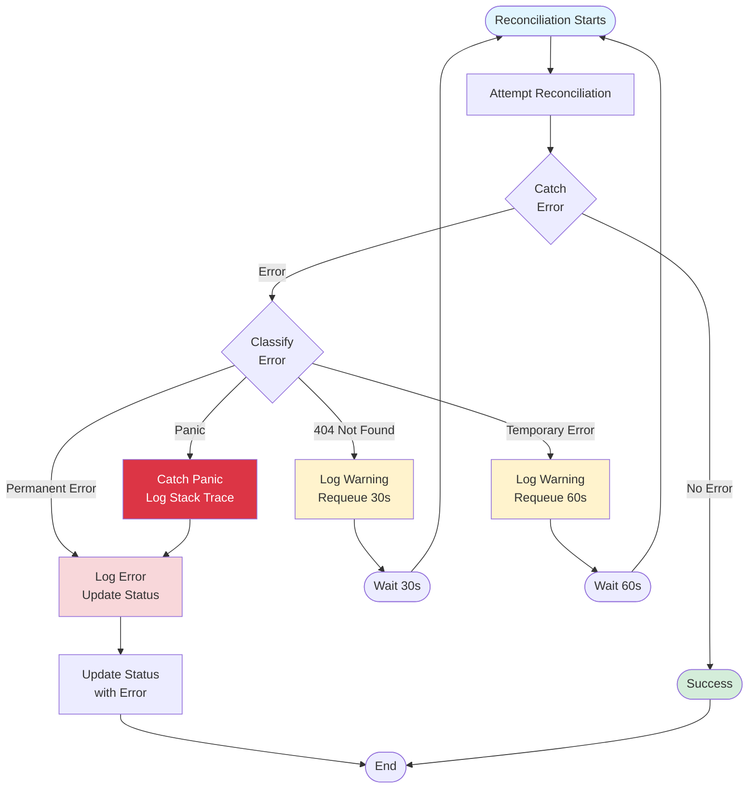

# Controller Audit and Design Documentation

## Executive Summary

This document provides a comprehensive audit of the Secret Manager Controller implementation, documenting what was broken, what has been fixed, and the current operational state. It also outlines the future state design with complete flow diagrams.

---

## Part 1: Audit - What Was Broken vs What Works

### Issues Identified and Fixed

#### 1. **HTTP Server Startup Race Condition** ✅ FIXED
**Problem:**
- Readiness probes failed with "connection refused" errors
- Server was marked ready before actually binding to port
- Fixed 200ms delay assumption didn't account for slow startup

**Solution:**
- Implemented polling loop to wait for server to actually bind
- Server marks itself ready when `TcpListener::bind()` succeeds
- 10-second timeout with 50ms poll interval
- Verifies server task hasn't crashed before proceeding

**Status:** ✅ Working - Server ready before controller starts

#### 2. **Missing Resource Validation** ✅ FIXED
**Problem:**
- No validation of required fields before processing
- Could panic on empty strings or missing values
- No early error detection

**Solution:**
- Added validation at start of reconciliation:
  - `sourceRef.kind` must not be empty
  - `sourceRef.name` must not be empty
  - `sourceRef.namespace` must not be empty
  - `secrets.environment` must not be empty
  - `gcp.projectId` must not be empty (for GCP provider)
- Clear error messages for invalid configs

**Status:** ✅ Working - Invalid configs caught early

#### 3. **Panic-Prone Error Handling** ✅ FIXED
**Problem:**
- Used `.unwrap()` calls that could panic
- No graceful error recovery
- Controller could crash on unexpected errors

**Solution:**
- Wrapped reconcile in error handler
- Replaced all `.unwrap()` with proper error handling
- All errors logged and returned gracefully
- Controller continues running even when individual reconciliations fail

**Status:** ✅ Working - No panics, graceful error handling

#### 4. **Missing GitRepository Handling** ✅ FIXED
**Problem:**
- Treated 404 (resource not found) as fatal error
- Incremented error metrics for expected conditions
- No retry logic for missing dependencies

**Solution:**
- Detect 404 errors specifically
- Log as warning (not error) - expected condition
- Return `Action::requeue(30s)` instead of failing
- Don't increment error metrics for 404s
- Automatic retry every 30 seconds

**Status:** ✅ Working - Graceful handling of missing dependencies

#### 5. **Insufficient Debug Logging** ✅ FIXED
**Problem:**
- Limited visibility into reconciliation process
- Hard to debug what resource is being processed
- No validation logging

**Solution:**
- Added comprehensive debug logging:
  - Resource details (name, namespace, sourceRef)
  - Secrets config (environment, prefix, basePath)
  - Provider config (type)
  - Source checking status
  - GitRepository fetch status

**Status:** ✅ Working - Full visibility into reconciliation

---

## Part 2: Current State - Sequence Diagrams and Flow Charts

### Current Startup Sequence

### Current Reconciliation Flow

### Current Error Handling Flow

---

## Part 3: Future State - Complete Reconciliation Flow

### Future State Sequence Diagram (Complete Flow)

### Future State Flow Chart (Complete Process)

### Future State - Complete Reconciliation with Kustomize Mode

### Future State - Error Recovery Flow

---

## Part 4: Implementation Status

### ✅ Completed Features

1. **HTTP Server Startup**
   - Polling-based startup verification
   - Readiness probe support
   - Health check endpoints

2. **Resource Validation**
   - Early validation of required fields
   - Clear error messages
   - Prevents invalid configs from being processed

3. **Error Handling**
   - No panics - all errors caught and handled
   - Graceful degradation
   - Proper error logging

4. **Missing Dependency Handling**
   - 404 detection for GitRepository
   - Automatic retry with backoff
   - Warning-level logging for expected conditions

5. **Debug Logging**
   - Comprehensive resource logging
   - Validation logging
   - Source checking status

### 🚧 In Progress / Next Steps

1. **GitRepository Integration**
   - ✅ Detection and fetching
   - ⏳ Artifact path extraction (partial)
   - ⏳ Artifact directory validation

2. **SOPS Decryption**
   - ✅ Key loading from Kubernetes secret
   - ✅ Decryption function exists
   - ⏳ Integration with file processing

3. **Secret Processing**
   - ⏳ File discovery (application.secrets.env)
   - ⏳ SOPS decryption integration
   - ⏳ Key-value parsing
   - ⏳ Cloud provider sync

4. **Status Updates**
   - ⏳ Condition tracking
   - ⏳ Success/failure status
   - ⏳ Metrics reporting

---

## Part 5: Key Design Decisions

### 1. Polling vs Fixed Delays
**Decision:** Use polling with timeout instead of fixed delays
**Rationale:** More reliable, handles slow startup, fails fast on errors

### 2. Warning vs Error for 404s
**Decision:** Log 404s as warnings, not errors
**Rationale:** Expected condition when dependencies don't exist yet, reduces noise in error metrics

### 3. Early Validation
**Decision:** Validate all required fields before processing
**Rationale:** Fail fast, clear error messages, prevents wasted processing

### 4. Error Wrapper
**Decision:** Wrap reconcile function in error handler
**Rationale:** Prevents panics from crashing controller, ensures all errors are logged

### 5. Requeue Strategy
**Decision:** Different requeue delays for different error types
**Rationale:** 
- 30s for missing dependencies (expected, frequent checks)
- 60s for other errors (less frequent, avoid thundering herd)

---

## Part 6: Metrics and Observability

### Current Metrics
- Reconciliation attempts
- Reconciliation errors (excluding 404s)
- Reconciliation duration
- Secrets managed count

### Future Metrics (Planned)
- GitRepository fetch success/failure
- SOPS decryption success/failure
- File processing counts
- Cloud provider sync success/failure
- Status update success/failure

---

## Conclusion

The controller has been significantly improved with proper error handling, validation, and graceful dependency management. The current implementation provides a solid foundation for the complete reconciliation flow, with clear separation of concerns and robust error recovery.

The future state diagrams show the complete end-to-end flow that will be implemented, including SOPS decryption, secret processing, and cloud provider synchronization.

