# Config Store Implementation Plan

## Executive Summary

This document outlines the implementation plan for routing `application.properties` (and other config files) to appropriate config stores while maintaining secrets in secret stores. The goal is to store secrets/configs in a single canonical way in application repos, then consume them optimally per cloud platform.

## Architecture Flows

### AWS (EKS) - Complete Flow


### GCP (GKE) - Secret Manager Flow (Default)


### GCP (GKE) - Parameter Manager Flow (Serverless Only)

```mermaid
graph TB
    subgraph Git["Git Repository (GitOps)"]
        GitRepo[Git Repository<br/>FluxCD/ArgoCD]
        SecretsFile[application.secrets.env<br/>application.secrets.yaml]
        ConfigFile[application.properties<br/>application.config.*]
    end
    
    subgraph Controller["Secret Manager Controller"]
        Reconciler[Reconciler<br/>Watches SecretManagerConfig]
        Parser[Parser<br/>SOPS Decryption]
        Router[Router<br/>File-based Routing]
    end
    
    subgraph GCP["GCP Cloud"]
        SecretMgr[GCP Secret Manager<br/>Secrets Store]
        ParamMgr[GCP Parameter Manager<br/>Config Store]
    end
    
    subgraph GKE["GKE Cluster"]
        ESO[External Secrets Operator<br/>Syncs Secrets Only]
        SecretsK8s[Kubernetes Secrets]
        Note[⚠️ No Operator for<br/>Parameter Manager]
    end
    
    subgraph Serverless["GCP Serverless"]
        CloudRun[CloudRun Services<br/>Environment Variables]
        CloudFunc[Cloud Functions<br/>API Calls]
    end
    
    GitRepo -->|GitOps Sync| Controller
    SecretsFile -->|Parse| Parser
    ConfigFile -->|Parse| Parser
    Parser -->|Decrypt SOPS| Router
    
    Router -->|Secrets| SecretMgr
    Router -->|Configs| ParamMgr
    
    SecretMgr -->|Sync| ESO
    ESO -->|Create| SecretsK8s
    
    ParamMgr -.->|❌ No Operator| Note
    
    ParamMgr -->|Env Vars| CloudRun
    ParamMgr -->|API| CloudFunc
    
    style SecretsFile fill:#ffcccc
    style ConfigFile fill:#ccffcc
    style SecretMgr fill:#ffcccc
    style ParamMgr fill:#ccffcc
    style SecretsK8s fill:#ffcccc
    style Note fill:#ffffcc
```



### Azure (AKS) - App Configuration Flow


### Complete Multi-Cloud Comparison Flow


### Key Insights from Architecture Flows

**Color Coding**:
- 🔴 **Red** (`#ffcccc`): Secrets and secret stores
- 🟢 **Green** (`#ccffcc`): Configs and config stores
- 🔵 **Blue** (`#ccccff`): GCP Secret Manager (handles both)
- 🟡 **Yellow** (`#ffffcc`): Warnings/limitations

**Key Observations**:

1. **AWS**: ✅ Complete flow - External Secrets Operator supports both Secrets Manager and Parameter Store
2. **GCP Secret Manager**: ✅ Complete flow - External Secrets Operator supports Secret Manager for both secrets and configs
3. **GCP Parameter Manager**: ⚠️ Incomplete flow - No operator support for GKE (serverless only)
4. **Azure**: ✅ Complete flow - External Secrets Operator for Key Vault + Azure App Config Provider for App Configuration

**Consumption Layer**:
- **Kubernetes**: Uses operators/providers to sync cloud stores → ConfigMaps/Secrets
- **Serverless**: Direct consumption via SDKs, extensions, or environment variables

## Current State vs Target State

### Current State

| File Type | Current Destination | Problem |
|-----------|---------------------|---------|
| `application.secrets.env` | Secret Store ✅ | Correct |
| `application.secrets.yaml` | Secret Store ✅ | Correct |
| `application.properties` | Secret Store ❌ | Non-secrets stored in expensive secret stores |

### Target State

| File Type | AWS Destination | GCP Destination | Azure Destination |
|-----------|----------------|-----------------|-------------------|
| `application.secrets.*` | Secrets Manager | Secret Manager | Key Vault |
| `application.properties` | **Parameter Store** | **Secret Manager OR Parameter Manager** (CRD config) | **App Configuration** |
| `application.config.*` | **Parameter Store** | **Secret Manager OR Parameter Manager** (CRD config) | **App Configuration** |

## Implementation Strategy by Provider

### AWS (EKS) - Parameter Store Implementation

#### Target Architecture

See [AWS Complete Flow](#aws-eks---complete-flow) diagram above.

**Flow Summary**:
```
Git → Controller → Parameter Store → External Secrets Operator → ConfigMaps
Git → Controller → Secrets Manager → External Secrets Operator → Secrets
```

#### Implementation Details

| Aspect | Details |
|--------|---------|
| **Config Store** | AWS Systems Manager Parameter Store |
| **Rust SDK** | `aws-sdk-ssm` (already available in AWS SDK) |
| **Parameter Path Format** | `/service-name/environment/key` (hierarchical) |
| **Authentication** | IRSA (IAM Roles for Service Accounts) - already supported |
| **Kubernetes Consumption** | ASCP (AWS Secrets and Configuration Provider) via Secrets Store CSI Driver |
| **Serverless Consumption** | Lambda Extension, SDK calls |
| **Implementation Complexity** | Low - SDK already available, similar to Secrets Manager |

#### CRD Configuration

```yaml
spec:
  provider:
    type: aws
    aws:
      region: us-east-1
      auth:
        authType: Irsa
        roleArn: arn:aws:iam::123456789012:role/secret-manager-role
  secrets:
    # Secrets go to Secrets Manager (default)
    environment: dev
    kustomizePath: microservices/my-service/profiles/dev
  configs:
    # NEW: Configs go to Parameter Store
    enabled: true
    parameterPath: /my-service/dev  # Optional: custom path prefix
```

#### Implementation Steps

1. ✅ Add `aws-sdk-ssm` dependency (if not already present)
2. Create `aws_parameter_store.rs` provider module
3. Implement `ConfigStoreProvider` trait (similar to `SecretManagerProvider`)
4. Update reconciler to route `application.properties` → Parameter Store
5. Store individual properties as separate parameters (not JSON blob)

### GCP - Hybrid Solution (Secret Manager OR Parameter Manager)

#### Target Architecture

See [GCP Secret Manager Flow](#gcp-gke---secret-manager-flow-default) and [GCP Parameter Manager Flow](#gcp-gke---parameter-manager-flow-serverless-only) diagrams above.

**Flow Summary (Secret Manager - Default)**:
```
Git → Controller → Secret Manager → External Secrets Operator → ConfigMaps/Secrets
Git → Controller → Secret Manager → CloudRun (secretKeyRef)
```

**Flow Summary (Parameter Manager - Serverless Only)**:
```
Git → Controller → Parameter Manager → CloudRun/Cloud Functions (env vars/API)
⚠️ No GKE support (would need External Parameter Manager controller)
```

#### Critical Finding: Kubernetes Consumption Gap

**External Secrets Operator Support**:
- ✅ **Secret Manager**: Fully supported by External Secrets Operator
- ❌ **Parameter Manager**: NOT supported by External Secrets Operator

**Options for Parameter Manager in GKE**:
1. **Secret Manager Add-on**: Can access Parameter Manager via Secret Manager API, but requires API calls (not native ConfigMap sync)
2. **Build External Parameter Manager**: New controller similar to External Secrets Operator (significant effort)
3. **Use Secret Manager**: Default option with External Secrets Operator support

#### Implementation Details

| Aspect | Secret Manager (Default) | Parameter Manager (Optional) |
|--------|------------------------|------------------------------|
| **Config Store** | Secret Manager | Parameter Manager |
| **Rust SDK** | ✅ `google-cloud-secretmanager-v1` (already in use) | ⚠️ Need to verify API availability |
| **GKE Consumption** | ✅ External Secrets Operator → ConfigMaps | ❌ No native operator support |
| **GKE Alternative** | ✅ External Secrets Operator | ⚠️ Would need "External Parameter Manager" controller |
| **Serverless Consumption** | ✅ `secretKeyRef` in CloudRun | ✅ Environment variables/API |
| **Cost** | Higher (~$0.06/secret/month) | Lower (optimized for configs) |
| **Implementation** | ✅ Ready (current behavior) | ⚠️ Research API + build operator |
| **Recommendation** | **Default for GKE** (External Secrets Operator support) | **Serverless only** (no GKE support without new operator) |

#### CRD Configuration

```yaml
spec:
  provider:
    type: gcp
    gcp:
      projectId: my-project
      auth:
        authType: WorkloadIdentity
        serviceAccountEmail: secret-manager@my-project.iam.gserviceaccount.com
  secrets:
    # Secrets always go to Secret Manager
    environment: dev
    kustomizePath: microservices/my-service/profiles/dev
  configs:
    # NEW: Configs routing decision
    store: SecretManager  # Options: SecretManager (default) or ParameterManager
    # If SecretManager: GKE uses External Secrets Operator
    # If ParameterManager: Lower cost, but GKE needs API calls
```

#### Implementation Steps

**Phase 1: Secret Manager (Default)**
1. ✅ Route `application.properties` → Secret Manager (current behavior, but as individual secrets)
2. ✅ GKE consumes via External Secrets Operator (already supported)
3. ✅ Serverless consumes via `secretKeyRef`

**Phase 2: Parameter Manager (Optional)**
1. Research Parameter Manager API availability
2. Create `gcp_parameter_manager.rs` provider module
3. Add CRD option: `configs.store: ParameterManager`
4. Update reconciler to route based on CRD config

#### Recommendation

⭐ **Strategic Approach**: **Contribute GCP Parameter Manager support to External Secrets Operator**

**Why**:
- Leverages existing, well-maintained infrastructure
- Benefits entire Kubernetes community
- Consistent experience across providers
- Avoids duplicating effort
- Industry standard approach

**Interim Solution**:
- **Default**: Secret Manager (External Secrets Operator support - already exists)
- **Future**: Parameter Manager (after contributing to ESO)

**CRD Choice**: Let users decide based on their workload mix
  - GKE workloads → Secret Manager (External Secrets Operator support) - **now**
  - GKE workloads → Parameter Manager (External Secrets Operator support) - **after contribution**
  - Serverless-only → Parameter Manager (lower cost) - **now**

See [Contributing to External Secrets Operator](CONTRIBUTING_TO_ESO.md) for detailed contribution plan.

### Azure - Hybrid Solution (Key Vault + App Configuration)

#### Target Architecture

See [Azure App Configuration Flow](#azure-aks---app-configuration-flow) diagram above.

**Flow Summary**:
```
Git → Controller → Key Vault → External Secrets Operator → Secrets
Git → Controller → App Configuration → Azure App Config Provider → ConfigMaps
Git → Controller → App Configuration → Azure Functions (SDK)
```

#### Critical Finding: Kubernetes Consumption

**External Secrets Operator Support**:
- ✅ **Key Vault**: Fully supported by External Secrets Operator
- ❌ **App Configuration**: NOT supported by External Secrets Operator

**Azure App Configuration Kubernetes Provider**:
- ✅ **Separate Provider**: Azure provides [Azure App Configuration Kubernetes Provider](https://github.com/Azure/AppConfiguration-KubernetesProvider)
- ✅ **Creates ConfigMaps**: Syncs App Configuration → Kubernetes ConfigMaps
- ✅ **Available as AKS Extension**: Can be installed via Helm or AKS extension

⭐ **Strategic Approach**: **Contribute Azure App Configuration support to External Secrets Operator**

**Why**:
- Unified experience with other providers
- Single operator for all config stores
- Consistent CRD interface
- Benefits entire Kubernetes community

**Interim Solution**: Use Azure App Configuration Kubernetes Provider (official Azure solution)

See [Contributing to External Secrets Operator](CONTRIBUTING_TO_ESO.md) for detailed contribution plan.

#### Implementation Details

| Aspect | Key Vault | App Configuration |
|--------|-----------|-------------------|
| **Purpose** | Secrets only | Configs only |
| **Rust SDK** | ✅ `azure_security_keyvault_secrets` (already in use) | ⚠️ Need `azure-app-configuration` crate |
| **AKS Consumption** | ✅ External Secrets Operator OR Secrets Store CSI Driver | ✅ Azure App Configuration Kubernetes Provider → ConfigMaps |
| **Serverless Consumption** | ✅ Key Vault references | ✅ App Configuration SDK |
| **Cost** | Higher (per operation) | Lower (per operation) |
| **Recommendation** | ✅ Keep for secrets | ✅ Use for configs (has native K8s provider) |

#### CRD Configuration

```yaml
spec:
  provider:
    type: azure
    azure:
      vaultName: my-vault
      auth:
        authType: WorkloadIdentity
        clientId: "12345678-1234-1234-1234-123456789012"
  secrets:
    # Secrets go to Key Vault (default)
    environment: dev
    kustomizePath: microservices/my-service/profiles/dev
  configs:
    # NEW: Configs go to App Configuration
    enabled: true
    appConfigEndpoint: https://my-app-config.azconfig.io  # Optional: auto-detect from vault region
```

#### Implementation Steps

1. Research `azure-app-configuration` Rust crate availability
2. Create `azure_app_config.rs` provider module
3. Implement `ConfigStoreProvider` trait
4. Update reconciler to route `application.properties` → App Configuration
5. Store individual properties as key-value pairs

## CRD Design

### Proposed CRD Structure

```yaml
apiVersion: secret-manager.microscaler.io/v1alpha1
kind: SecretManagerConfig
metadata:
  name: my-service-config
spec:
  # Existing fields
  sourceRef:
    kind: GitRepository
    name: my-repo
    namespace: flux-system
  provider:
    type: aws  # aws | gcp | azure
    # ... provider-specific config
  secrets:
    environment: dev
    kustomizePath: microservices/my-service/profiles/dev
    prefix: my-service
    suffix: -prod
  
  # NEW: Config store configuration
  configs:
    # Enable config store sync (default: false for backward compatibility)
    enabled: true
    
    # GCP-specific: Choose store type
    # Options: SecretManager (default) or ParameterManager
    # Only applies when provider.type == gcp
    store: SecretManager  # SecretManager | ParameterManager
    
    # AWS-specific: Parameter path prefix
    # Only applies when provider.type == aws
    parameterPath: /my-service/dev  # Optional: defaults to /{prefix}/{environment}
    
    # Azure-specific: App Configuration endpoint
    # Only applies when provider.type == azure
    appConfigEndpoint: https://my-app-config.azconfig.io  # Optional: auto-detect
    
    # File patterns to route to config store (default: application.properties, application.config.*)
    files:
      - application.properties
      - application.config.env
      - application.config.yaml
```

### Backward Compatibility

- **Default behavior**: `configs.enabled: false` → all files go to secret stores (current behavior)
- **Migration path**: Users enable `configs.enabled: true` to opt into config store routing
- **No breaking changes**: Existing CRDs continue to work

## SDK/Crate Availability

| Provider | Service | Rust Crate | Status | Notes |
|----------|---------|------------|--------|-------|
| **AWS** | Parameter Store | `aws-sdk-ssm` | ✅ Available | Part of AWS SDK, already in ecosystem |
| **GCP** | Secret Manager | `google-cloud-secretmanager-v1` | ✅ Available | Already in use |
| **GCP** | Parameter Manager | TBD | ⚠️ Research needed | May need API client or use Secret Manager API |
| **Azure** | Key Vault | `azure_security_keyvault_secrets` | ✅ Available | Already in use |
| **Azure** | App Configuration | `azure-app-configuration` | ⚠️ Research needed | Need to verify crate availability |

## Consumption Methods Summary

### Serverless Systems

| Provider | Secret Store | Config Store | Consumption Method |
|----------|-------------|--------------|-------------------|
| **AWS Lambda** | Secrets Manager | Parameter Store | Lambda Extensions (caching), SDK calls |
| **GCP CloudRun** | Secret Manager | Parameter Manager | `secretKeyRef`, Environment variables/API |
| **Azure Functions** | Key Vault | App Configuration | Key Vault references, App Config SDK |

### Kubernetes Workloads

| Provider | Secret Store | Config Store | Consumption Method |
|----------|-------------|--------------|-------------------|
| **EKS** | Secrets Manager | Parameter Store | Secrets Store CSI Driver + ASCP (mounts as files) |
| **GKE** | Secret Manager | Secret Manager | External Secrets Operator (industry standard) |
| **GKE** | Secret Manager | Parameter Manager | API calls (no native mounting) |
| **AKS** | Key Vault | App Configuration | Secrets Store CSI Driver (secrets), SDK calls (configs) |

## Implementation Phases

### Phase 1: AWS Parameter Store (Priority: High)

**Goal**: Implement Parameter Store support for AWS

**Tasks**:
1. Add `aws-sdk-ssm` dependency to `Cargo.toml`
2. Create `src/aws_parameter_store.rs` module
3. Implement `ConfigStoreProvider` trait
4. Update `src/reconciler.rs` to route `application.properties` → Parameter Store
5. Store individual properties as separate parameters (not JSON blob)
6. Add CRD field: `configs.enabled: true`
7. Add tests
8. Update documentation

**Estimated Effort**: 2-3 days

**Dependencies**: None (SDK already available)

### Phase 2: GCP Secret Manager (Default for Configs)

**Goal**: Route configs to Secret Manager (better GKE integration)

**Tasks**:
1. Update reconciler to route `application.properties` → Secret Manager
2. Store individual properties as separate secrets (not JSON blob)
3. Document External Secrets Operator usage for GKE
4. Add CRD field: `configs.enabled: true` (defaults to Secret Manager)

**Estimated Effort**: 1-2 days

**Dependencies**: None (already using Secret Manager)

### Phase 3: GCP Parameter Manager (Optional)

**Goal**: Add Parameter Manager option for lower-cost serverless workloads

**Tasks**:
1. Research Parameter Manager API availability
2. Create `src/gcp_parameter_manager.rs` module (if API available)
3. Add CRD option: `configs.store: ParameterManager`
4. Update reconciler to route based on CRD config
5. Add tests
6. Update documentation

**Estimated Effort**: 2-3 days (if API available)

**Dependencies**: Parameter Manager API availability

### Phase 4: Azure App Configuration

**Goal**: Implement App Configuration support for Azure

**Tasks**:
1. Research `azure-app-configuration` Rust crate availability
2. Add crate to `Cargo.toml` (if available)
3. Create `src/azure_app_config.rs` module
4. Implement `ConfigStoreProvider` trait
5. Update reconciler to route `application.properties` → App Configuration
6. Store individual properties as key-value pairs
7. Add CRD field: `configs.appConfigEndpoint`
8. Add tests
9. Update documentation

**Estimated Effort**: 2-3 days

**Dependencies**: `azure-app-configuration` crate availability

## File Routing Logic

### Current Logic

```rust
// All files → Secret Store
application.secrets.env → Secret Store
application.secrets.yaml → Secret Store
application.properties → Secret Store (as JSON blob)
```

### Proposed Logic

```rust
// File-based routing
if file_name.contains("secrets") {
    → Secret Store
} else if file_name == "application.properties" || file_name.contains("config") {
    if configs.enabled {
        → Config Store (based on provider and CRD config)
    } else {
        → Secret Store (backward compatibility)
    }
}
```

### File Patterns

| Pattern | Route To | Notes |
|---------|----------|-------|
| `application.secrets.env` | Secret Store | Always |
| `application.secrets.yaml` | Secret Store | Always |
| `application.properties` | Config Store (if enabled) | Default: Secret Store (backward compat) |
| `application.config.env` | Config Store (if enabled) | New file type |
| `application.config.yaml` | Config Store (if enabled) | New file type |

## Testing Strategy

### Unit Tests
- Config store provider implementations
- File routing logic
- Parameter path construction

### Integration Tests
- AWS Parameter Store sync
- GCP Secret Manager config sync
- Azure App Configuration sync

### E2E Tests (Pact Tests)
- Full reconciliation flow with config stores
- Verify configs are stored correctly
- Verify consumption methods work

## Migration Guide

### For Existing Users

1. **No action required**: Existing CRDs continue to work (all files → secret stores)
2. **Opt-in**: Add `configs.enabled: true` to enable config store routing
3. **GCP users**: Choose `configs.store: SecretManager` (default) or `ParameterManager`
4. **Verify**: Check that configs are synced to correct stores
5. **Update consumption**: Update serverless/K8s configs to consume from config stores

### Example Migration

**Before**:
```yaml
spec:
  secrets:
    environment: dev
    kustomizePath: microservices/my-service/profiles/dev
```

**After** (AWS):
```yaml
spec:
  secrets:
    environment: dev
    kustomizePath: microservices/my-service/profiles/dev
  configs:
    enabled: true
    parameterPath: /my-service/dev
```

## Risk Assessment

| Risk | Impact | Mitigation |
|------|--------|-----------|
| Breaking existing deployments | High | Backward compatibility: `configs.enabled: false` by default |
| SDK availability (GCP Parameter Manager, Azure App Config) | Medium | Research first, fallback to Secret Manager/Key Vault |
| Cost increase (more API calls) | Low | Config stores are cheaper than secret stores |
| Complexity increase | Medium | Clear CRD design, good documentation |

## Success Criteria

1. ✅ `application.properties` routes to config stores (not secret stores)
2. ✅ Backward compatibility maintained (existing CRDs work)
3. ✅ All three providers supported (AWS, GCP, Azure)
4. ✅ Clear CRD configuration for routing decisions
5. ✅ Documentation updated
6. ✅ Tests passing
7. ✅ Migration guide available

## Next Steps

1. **Research**: Verify SDK availability for GCP Parameter Manager and Azure App Configuration
2. **Design Review**: Review CRD design with team
3. **Phase 1**: Implement AWS Parameter Store support
4. **Phase 2**: Implement GCP Secret Manager config routing (default)
5. **Phase 3**: Add GCP Parameter Manager option (if API available)
6. **Phase 4**: Implement Azure App Configuration support

